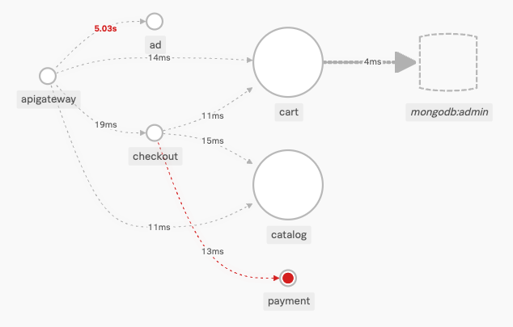

## TE Datagen
# Splunk Application Performance Monitoring
This repository contains a microservices demo for Splunk Application Monitoring (APM). The datagen uses OpenTelemetry and auto-instrumentation to send trace/span data to APM.

The datagen is a React UI frontend that sends HTTP requests to an API Gateway. The gateway, in turn, sends additional requests to the rest of the services. The datagen allows you to configure the following for any of the services that are contacted by the gateway:
- the response delay (in seconds)
- the HTTP response code

The datagen can be configured to send requests as follows:
- a request can be sent to the API Gateway once every 10, 20, or 30 seconds
- the request can be repeated for a 15 minute interval, with a maximum total time allowed of 2 hours

By using this datagen, you can "light up" any of the connections between services or any service node itself. For example, if you set the HTTP response delay for the *ad* service to 5 seconds, and you set the response code for the *payment* service to 401, you would see the following in the Splunk APM service map:



## Requirements
- Docker
- Docker Compose

## Installation & Configuration
1. Clone the GitHub repository
    ```
    git clone https://github.com/pgodby/te-apm-datagen
    ```
1. In the **base** directory, create a new file named **collector.env**. In this file, enter the following key-value pairs to configure the demo for your Splunk APM realm. Replace the values listed below as follows:
    - access_token = Enter a valid access token from your APM realm.
    - realm = Enter your APM realm. For example: us1
    ```
    SPLUNK_ACCESS_TOKEN=<access_token>
    SPLUNK_REALM=<realm>
    ```
3. In the **base** directory, create a new file named **apm.env**. In this file, enter the following key-value pairs to configure the deployment for each of the microservices in your Splunk APM realm. Leave the OTEL_EXPORTER_OTLP_ENDPOINT as specified to ensure each service can contact the containerized Splunk OTEL Collector.
    - name = Enter a unique name for your deployment environment. This value can be used to filter for your specific microservices in APM.
    ```
    OTEL_RESOURCE_ATTRIBUTES=deployment.environment=<name>
    OTEL_EXPORTER_OTLP_ENDPOINT=http://splunk-otel-collector:4317
    ```

## Start the demo
1. In a terminal, execute the following commands to build and start the Docker containers. Leave this terminal running for the duration of the demo.
    ```
    cd /te-apm-datagen/base
    docker-compose up --build
    ```

## Configure the demo
1. In a browser, visit the IP address of the server. If you are working on your own machine, visit *localhost*.
1. For each service, configure the desired HTTP response delay and the HTTP status code that should be returned. These values will apply to all requests received by the service.
1. At the top, choose a duration for the simulation. You can also alter the interval between HTTP requests. By default, the demo will make HTTP requests every 10 seconds for 15 minutes.
1. At the top, press the **play/start** button to start the demo.
1. Log in to Splunk APM and filter for your environment. Review the services and explore the service map. If you increased the response delay or changed the HTTP status code for a specific service, it should now appear in red in the service map.
1. It may take several minutes for the data to fully appear and for any errors to be captured.

## Stop the demo
1. In the terminal where the docker containers were started, press **CTRL-C** to stop all of the containers.